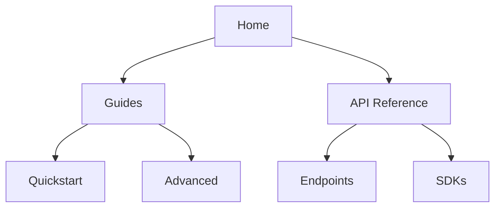

## Overview

Follow these best practices to create clear, maintainable documentation for your savanth projects. Structure your content logically, leverage Markdown with rich components, and collaborate effectively with your team. This approach ensures users find information quickly and developers contribute seamlessly.

<Columns cols={3}>
  <Card title="Organize Hierarchies" icon="layout" href="#organizing-content-hierarchies">
    Build intuitive navigation with nested sections.
  </Card>
  <Card title="Rich Markdown" icon="edit-3" href="#using-markdown-and-rich-media">
    Combine text, code, and visuals for engagement.
  </Card>
  <Card title="Team Collaboration" icon="users" href="#collaborating-with-team-members">
    Streamline reviews and updates.
  </Card>
</Columns>

## Organizing Content Hierarchies

Plan your documentation with a clear hierarchy: start with high-level overviews, then drill into specifics. Use H2 for main topics, H3 for subtopics, and H4 for details. Avoid skipping levels to maintain readability.

<Callout kind="tip">
  Limit pages to 1500-2000 words. Split long guides into focused subpages.
</Callout>

### Steps to Build Your Hierarchy

<Steps>
  <Step title="Map User Journeys" icon="map">
    Identify key user paths: onboarding, API usage, troubleshooting.
  </Step>
  <Step title="Create Navigation" icon="menu">
    Use sidebar menus for quick access. Group related pages under sections.
  </Step>
  <Step title="Test Navigation" icon="search">
    Walk through as a new user. Ensure paths take `<3` clicks to core info.
  </Step>
</Steps>



## Using Markdown and Rich Media

Write concise prose with active voice. Enhance with components like `<Steps>`, `<Tabs>`, and code blocks. Always escape special characters in text, such as `{API_KEY}` or `<100ms`.

<Tabs>
  <Tab title="Basic Markdown" icon="edit">
    Use standard syntax for lists and tables.

    | Element     | Syntax Example          |
    |-------------|-------------------------|
    | Bold        | `**text**`             |
    | Inline Code | `` `code` ``           |
    | Links       | `[text](url)`          |
  </Tab>
  <Tab title="Rich Components" icon="layers">
    Embed interactive elements for better engagement.
  </Tab>
</Tabs>

### Multi-Language Code Examples

Show platform-specific code with `<CodeGroup>`.

<CodeGroup tabs="JavaScript,Python">
  ```javascript
  const response = await fetch('https://api.savanth.io/v1/projects', {
    headers: { Authorization: `Bearer ${API_KEY}` }
  });
  const data = await response.json();
  console.log(data);
  ```
  ```python
  import requests
  headers = {'Authorization': f'Bearer {API_KEY}'}
  response = requests.get('https://api.savanth.io/v1/projects', headers=headers)
  data = response.json()
  print(data)
  ```
</CodeGroup>

<Callout kind="info">
  Add `show-lines={true}` to code blocks for debugging complex snippets.
</Callout>

## Collaborating with Team Members

Set up version control and review processes early. Assign owners to sections and use pull requests for changes.

### Collaboration Workflow

<Steps>
  <Step title="Draft Changes" icon="edit-3">
    Create a feature branch: `git checkout -b docs-improve-api-guide`.
  </Step>
  <Step title="Review with Team" icon="eye">
    Open a PR and request reviews from at least two team members.
  </Step>
  <Step title="Merge and Deploy" icon="git-merge">
    Merge after approvals. Preview builds automatically.
  </Step>
</Steps>

<ExpandableGroup>
  <Expandable title="Advanced Tips" default-open="false">
    Use labels like `docs`, `review-needed` in PRs. Schedule bi-weekly doc sprints.
    
    Integrate with CI/CD: Lint Markdown with tools like `markdownlint`.
  </Expandable>
</ExpandableGroup>

Maintain consistency by defining a style guide: second-person voice, present tense, and precise terms. Regularly audit for outdated content to keep your savanth documentation fresh and reliable.