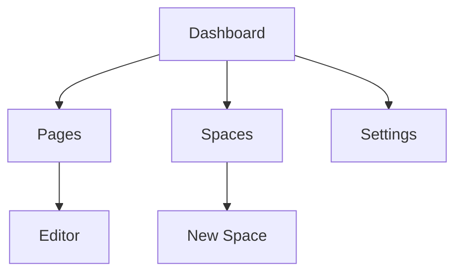

## Overview

Get started with savanth Documentation in minutes. You create your first documentation space, add pages, and navigate the interface using simple steps. This guide walks you through the essentials to build your project docs.

<Callout kind="tip">
  savanth uses Markdown and MDX for rich, interactive documentation. Enable brand color `#3B82F6` in your space settings for custom styling.
</Callout>

## Create a New Documentation Space

Follow these steps to set up your space.

<Steps>
  <Step title="Sign Up" icon="user-plus">
    Visit savanth.com and create an account with your email or GitHub.
  </Step>
  <Step title="Create Space" icon="plus">
    Click **New Space** in the dashboard. Enter a name like `My Project Docs` and select a template.
  </Step>
  <Step title="Configure Settings" icon="settings">
    Set your brand color to `#3B82F6` and add a description: "Official docs for my project."
  </Step>
</Steps>

## Add Your First Page

Add content using the visual editor or CLI. Choose your preferred method below.

<Tabs>
  <Tab title="Visual Editor" icon="edit-3">
    Navigate to your space and click **New Page**.

    1. Enter title: `Quickstart`.
    2. Write in the editor using Markdown.

    ```markdown
    # Welcome

    This is your first page.
    ```

    3. Preview and publish.
  </Tab>
  <Tab title="CLI" icon="terminal">
    Install the savanth CLI first.

    <CodeGroup tabs="npm,yarn">
    ```bash
    npm install -g @savanth/cli
    ```
    ```bash
    yarn global add @savanth/cli
    ```
    </CodeGroup>

    Initialize and create a page:

    ```bash
    savanth init my-docs
    cd my-docs
    savanth page create quickstart.mdx
    ```

    Edit `quickstart.mdx` with your content.
  </Tab>
</Tabs>

## Navigate the Interface

The dashboard provides quick access to key areas.

<Columns cols={3}>
  <Card title="Pages" icon="file-text" href="/docs/pages">
    Manage all your documentation pages here. Edit, delete, or reorder.
  </Card>
  <Card title="Spaces" icon="folder" href="/docs/spaces">
    Switch between multiple documentation spaces.
  </Card>
  <Card title="Settings" icon="settings" href="/docs/settings">
    Customize themes, integrations, and permissions.
  </Card>
</Columns>



<Expandable title="Advanced Navigation Tips" default-open="false">
  Use keyboard shortcuts: <kbd>Ctrl</kbd>+<kbd>P</kbd> for quick search, <kbd>Ctrl</kbd>+<kbd>S</kbd> to save.

  Integrate with GitHub for version control:

  ```yaml
  repo: my-org/my-docs
  branch: main
  ```
</Expandable>

## Next Steps

<Callout kind="success">
  Congratulations! Your first space is live. Share the URL with your team.
</Callout>

Explore these resources:

| Topic          | Description                          |
|----------------|--------------------------------------|
| Custom Themes | Style with CSS variables             |
| API Reference | Automate docs with savanth API       |
| Collaboration | Invite team members and set roles    |

Your documentation space now organizes all project content efficiently. Add more pages and customize as needed.